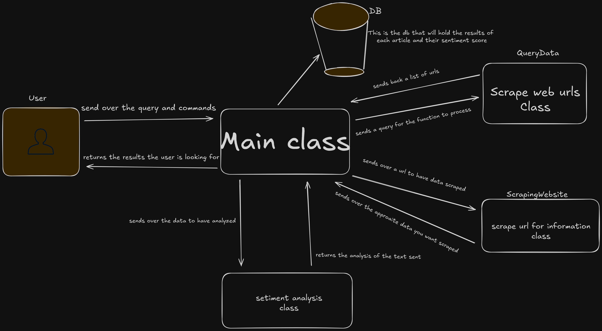

# 👁️ SentientCrawler


## Description
Smarter scraping for a smarter web.

SentientCrawler is a next-gen web scraping and analysis tool built to go beyond simply collecting data—it’s designed to understand and evaluate the information it gathers.

At its core, this project takes a user-provided query and uses Google Search (for now) to find relevant content across the internet. Once results are collected, SentientCrawler doesn't stop there—it visits each link, reads the content, summarizes it using a language model, and performs sentiment analysis to determine the overall tone of the article. The sentiment is scored on a 0–10 scale, where 0 reflects a very negative tone, and 10 indicates an extremely positive one.

🚀 Planned Features & Roadmap
This project is just getting started, but here's where it's headed:

Multi-search engine support (Yahoo, Bing, and beyond)

Custom-built web crawler (eventually replacing dependency on search engines)

LLM-powered summarization for clean, concise insights

Sentiment analysis model to rate article tone

Credibility detection to assess source legitimacy (via ML or third-party APIs)

Creating a full-fledged crawler from scratch will definitely be a journey (wish me luck—hell on Earth ahead 😅), but the long-term goal is to build a pipeline that finds, understands, and evaluates information with as little human input as possible.

If you’re curious about AI, NLP, or just want to build smarter tools for navigating the web, this project might be worth watching—or contributing to.

Stay tuned. This is just the beginning.

## Diagram



## Get started

### Spin up environment
To spin up a virutal environment

```bash
    make environment
```

---

### Activate virtual environment
To activate the virtual environment directly

```bash
    source activateEnv.sh
```

<p align="center">
    or
</p>


```bash
    make activate
```

granted though you will have to copy the result from the makefile and paste the result in your command line and execute it yourself.

---

### Installing python packages

To get all of the packages that I'm using in this project run the command below. It will automatically download all of the packages for you :)

```bash
    make download
```
---

## Run Application
